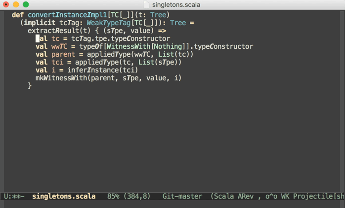

# println-debugger

Quick generating of println expressions in Emacs Lisp, Scala, Javascript, Typescript and Rust.

```elisp
(use-package println-debugger
  :bind (:map
         emacs-lisp-mode-map
         ([remap sp-next-sexp] . println-insert)
         ("C-M-n" . println-insert)
         :map scala-mode-map
         ([remap sp-next-sexp] . println-insert)
         ("C-M-n" . println-insert)
         :map js-mode-map
         ([remap sp-next-sexp] . println-insert)
         ("C-M-n" . println-insert)))
 ```

println-debugger in action (outdated)



Useful resources for starting with tree-sitter on emacs:  https://emacsconf.org/2022/talks/treesitter/ (https://www.youtube.com/watch?v=MZPR_SC9LzE)
